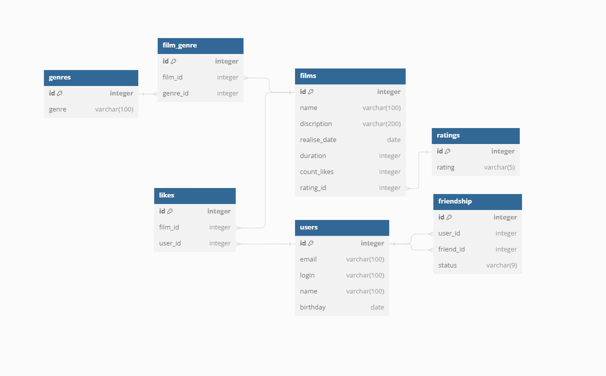

# java-filmorate
Template repository for Filmorate project.
# Схема базы данных

## Примеры запросов для основных операций приложения

1. Получение всех пользователей:

'''SQL
SELECT * FROM users;
'''

2. Получение пользователя по ID:

'''SQL
SELECT * FROM users WHERE id = ?;
'''

3. Получение списка друзей пользователя:

'''SQL
SELECT freiend_id FROM friendship WHERE user_id = ? AND status = 'confirmid';
'''

4. Получение всех фильмов:

'''SQL
SELECT * FROM films AS f JOIN ratings AS r f.rating_id = r.id ;
'''

5. Получение фильма по ID:

'''SQL
SELECT *

FROM films AS f

INNER JOIN ratings AS r f.rating_id = r.id

WHERE id = ?;
'''

6. Получение списка пользователей, котрые лайкнули определенный фильм:

'''SQL
SELECT *

FROM users

WHERE id IN (
SLECT user_id

	FROM likes

	WHERE film_id = ?
);
'''